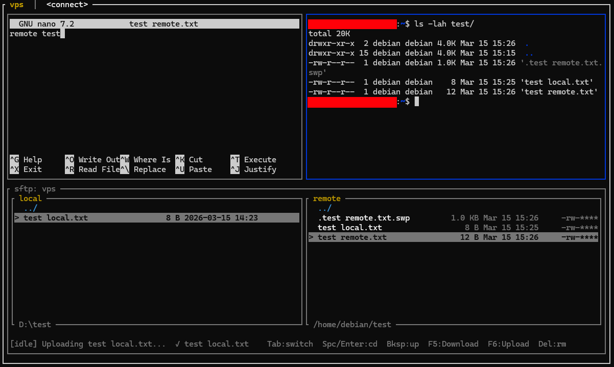

# sshmux



SSH session multiplexer that runs inside your local terminal. Tabs, split panes, and two-panel file browsers (SFTP and SCP), all driven by the system `ssh`, `sftp`, and `scp` binaries — no additional SSH library dependency.

> [!CAUTION]
> This project started as a personal vibecoded tool to manage an ever-growing list of SSH connections at work. It solved the problem well enough that it felt worth sharing. It is not a polished product — use it as a starting point, adapt it freely, and contribute back if you find it useful.

---

## Features

- Tabs and split panes -- run multiple SSH sessions side by side in a single terminal window
- Two-panel file browsers with both SFTP and SCP backends for remote file management
- Reads hosts from `~/.ssh/config` -- no separate configuration file needed
- Uses system `ssh`, `sftp`, and `scp` binaries -- inherits your SSH agent, keys, jump hosts, and proxy settings
- 1000-line scrollback in interactive sessions, with mouse scroll support
- Mouse forwarding (SGR encoding) to remote applications that request it
- File transfers with progress indication (percentage for single files, file count for directories)
- Batch operations: multi-select files with Shift+Up/Down, then transfer or delete in one action
- Drag-and-drop upload: drop files from your OS file manager onto a browser pane
- Recursive directory deletion via the SCP browser (`rm -rf`), which SFTP cannot do
- SCP browser works on servers without the SFTP subsystem
- Drive picker on Windows for navigating between local volumes
- Works on Windows (ConPTY) and Linux

---

## SSH config

Hosts are read from `~/.ssh/config` at startup. Any non-wildcard `Host` entry is listed in the connect pane. The `ssh` and `sftp` binaries inherit the full system environment including SSH agent, `~/.ssh/config` options, and jump hosts.

## Keybindings

### Global (work in any pane)

| Key | Action |
|---|---|
| `Alt+T` | New tab |
| `Alt+W` | Close focused pane (closes tab if last pane) |
| `Alt+-` | Split pane vertically (top / bottom) |
| `Alt++` | Split pane horizontally (left / right) |
| `Alt+↑` / `Alt+↓` | Cycle focus between panes |
| `Alt+←` / `Alt+→` | Switch tabs |
| `Alt+Q` | Quit |

### Connect pane

| Key | Action |
|---|---|
| `↑` / `k` | Select previous host |
| `↓` / `j` | Select next host |
| `Enter` | Open SSH session |
| `c` | Connect manually (type SSH args) |
| `b` | Open file browser menu (SFTP or SCP) |
| `h` | Toggle shortcut help overlay |
| `Esc` | Close overlay |

### Session pane (SSH)

Standard terminal input. Notable mappings:

| Key | Sent |
|---|---|
| `Ctrl+<letter>` | C0 control code |
| `Ctrl+Arrow` | `ESC[1;5D/C/A/B` (word navigation) |
| `Backspace` | `0x7f` |
| `F1`–`F12` | xterm sequences |

Mouse events forwarded as SGR sequences when the remote app enables mouse reporting.

Scrollback: mouse scroll navigates 1000 lines of history when the remote app is not capturing mouse. In alternate screen apps (vim, htop, less), scroll sends arrow keys instead. Any keypress snaps back to live view.

### File browser pane (SFTP & SCP)

Two browser backends are available from the connect pane menu (`b`):

- **SFTP** — uses the `sftp` subsystem. Works on most servers out of the box.
- **SCP** — uses a persistent `ssh` shell for browsing (`ls`, `rm`) and spawns `scp` processes for transfers. Works on servers without the SFTP subsystem and supports recursive directory deletion (`rm -rf`).

| Key | Action |
|---|---|
| `Tab` | Toggle local / remote panel focus |
| `↑` / `↓` | Navigate entries |
| `Shift+↑` / `Shift+↓` | Extend multi-selection |
| `←` / `→` | Scroll long file names |
| `Space` / `Enter` | Enter directory |
| `Backspace` | Go up one directory |
| `t` | Transfer: download (remote focus) or upload (local focus) |
| `Delete` | Delete focused file or selection (confirmation required) |
| `y` | Confirm deletion |
| `n` / `Esc` | Cancel deletion |

Drag-and-drop: click on one panel and release on the other to transfer. Multi-selected files are transferred as a batch. Files dragged from the OS file manager onto a browser pane are queued for upload with a confirmation prompt.

---

## Architecture

```
┌─────────────────────────────────────────────────────────┐
│                   sshmux process                        │
│                                                         │
│  main loop (5 ms poll)                                  │
│  ┌──────────────┐    ┌──────────────────────────────┐   │
│  │ crossterm    │    │ App                          │   │
│  │ event input  │──┐ │  Vec<Tab>                    │   │
│  └──────────────┘  │ │    Tab                       │   │
│                    │ │      Pane (tree)             │   │
│  ┌──────────────┐  │ │        Connect               │   │
│  │ ratatui      │<─┤ │        Session               │   │
│  │ draw buffer  │  │ │        FileBrowser (SFTP)    │   │
│  └──────────────┘  │ │        SshBrowser  (SCP)     │   │
│                    │ │        Split{H|V, children}  │   │
│  ┌──────────────┐  │ └──────────────────────────────┘   │
│  │ input.rs     │<─┘                                    │
│  │ key / mouse  │──> dispatch to focused pane           │
│  └──────────────┘                                       │
│                                                         │
│  Per Session / FileBrowser:                             │
│                                                         │
│  main thread             reader thread                  │
│  ┌─────────────┐         ┌─────────────────────────┐    │
│  │ send_str()  │         │ reader.read()           │    │
│  │     │       │         │   │                     │    │
│  │     v       │         │   ├─> vt100::Parser     │    │
│  │  writer     │         │   │   (screen grid +    │    │
│  │  (Mutex)    │         │   │   1000-line scroll) │    │
│  └──────┬──────┘         │   ├─> raw_output Vec<u8>│    │
│         │                │   │     (browsers only) │    │
│         │                │   ├─> dirty AtomicBool  │    │
│         │                │   └─> DSR reply         │    │
│         │                └─────────────┬───────────┘    │
│         │                              │                │
│         v                              v                │
│  ┌──────────────────────────────────────────────────┐   │
│  │          portable_pty  (PTY master)              │   │
│  │          PTY slave fd                            │   │
│  └───────────────────────────┬──────────────────────┘   │
│                              │  spawn                   │
└──────────────────────────────┼──────────────────────────┘
                               │
               ┌───────────────┼────────────────┐
               │               │                │
         ┌─────v──────┐  ┌────v───────┐  ┌──────v─────┐
         │  ssh host  │  │ sftp host  │  │  ssh host  │
         │  (Session) │  │(FileBrowser│  │(SshBrowser │
         │            │  │ hidden PTY)│  │ hidden PTY)│
         └────────────┘  └────────────┘  └─────┬──────┘
                                               │ transfers
                                         ┌─────v──────┐
                                         │  scp host  │
                                         │ (temp PTY) │
                                         └────────────┘
```

### Module structure

| Module | Role |
|---|---|
| `main.rs` | Event loop: poll → `input::handle_key`/`handle_mouse` → render |
| `input.rs` | All key and mouse dispatch (connect, session, browsers) |
| `app.rs` | `App` state: tabs, host list, session/browser creation |
| `pane.rs` | `Pane` tree (recursive enum), split layout, border rendering |
| `browser/common.rs` | `BrowserCore` — shared state and rendering for both browsers |
| `browser/sftp.rs` | `FileBrowser` — SFTP state machine and commands |
| `browser/ssh.rs` | `SshBrowser` — SSH/SCP state machine, password handling |
| `browser/parse.rs` | `ls -la` parsing, ANSI stripping, transfer progress scraping |
| `terminal.rs` | `EmbeddedTerminal` — PTY wrapper (portable\_pty + vt100) |
| `tab.rs` | `Tab` — pane tree + focus index |
| `ssh_config.rs` | `~/.ssh/config` parser |

Both `FileBrowser` and `SshBrowser` hold a `BrowserCore` field (`core`) that provides all shared browser functionality: dual-panel rendering, local navigation, click/drag handling, delete confirmation, and the common key dispatch via `handle_browser_key()`. Browser-specific logic (SFTP commands, SCP process spawning, password prompts) stays on the outer struct.

### PTY data flow (Session pane)

```
keystroke
    │
    v
crossterm Event::Key
    │
    v
send_str() / send_char()
    │  write bytes
    v
PTY master writer ───────────────────────────────────┐
                                                     │ PTY slave stdin
                                               ┌─────v─────┐
                                               │  ssh(1)   │
                                               │  process  │
                                               └─────┬─────┘
                                                     │ PTY slave stdout
PTY master reader <──────────────────────────────────┘
    │
    ├─> vt100::Parser::process(bytes)
    │        └─> screen grid + scrollback updated
    │            (mouse mode, app cursor, alt screen
    │             queried via screen() at render time)
    │
    ├─> raw_output.extend(bytes)      (browsers only, capture_raw=true)
    │
    ├─> dirty.store(true)            ──> triggers ratatui redraw
    │
    └─> reply to DSR (ESC[6n)        ──> neovim/htop cursor probe
```

### SFTP state machine (FileBrowser)

```
Connecting
    │  prompt stable × 2 ticks
    v
WaitingPwd ── send "pwd\r\n"
    │  prompt stable
    v
WaitingLs ── send "ls -la\r\n"
    │  prompt stable, parse_ls()
    v
Idle <──────────────────────────────────────────────┐
    │                                               │
    ├── cd dir ──> WaitingLs ──────────────────────>┘
    │                                               │
    ├── get/put ──> Transferring ──> WaitingLs ────>┘
    │                                               │
    └── rm/rmdir ──> WaitingDelete ──> WaitingLs ──>┘
```

"Stable" means the raw PTY buffer byte count has not changed for 2 consecutive ticks (~10 ms) and the last non-empty line contains `sftp>`. This prevents acting on a prompt that appears mid-output before all data has been flushed.

### SCP state machine (SshBrowser)

```
Connecting ── user authenticates via SSH PTY
    │  shell prompt detected ($ / # / %)
    v
SettingPrompt ── send PS1='SSHMUX> '
    │  SSHMUX> prompt appears
    v
WaitingPwd ── send "pwd\r\n"
    │  prompt stable
    v
WaitingLs ── send "ls -la\r\n"
    │  prompt stable, parse_ls()
    v
Idle <──────────────────────────────────────────────┐
    │                                               │
    ├── cd dir ──> WaitingLs ──────────────────────>┘
    │                                               │
    ├── transfer ──> Transferring (scp process) ───>┘
    │                                               │
    └── rm ──> WaitingDelete ──> WaitingLs ────────>┘
```

Transfers spawn a separate `scp` process (new SSH connection). Password prompts during SCP are detected and forwarded to the user.

---

## Build

```
cargo build --release
```

Binary: `target/release/sshmux`

## Logging

```
sshmux --debug
```

Creates a timestamped log file (`sshmux-debug-YYYYMMDD_HHMMSS.log`) in the current directory. Log levels:

- **info** — session lifecycle (connect, disconnect, transfers, deletes)
- **warn** — recoverable issues (password rejected, delete failed)
- **error** — failures (PTY errors, spawn failures)
- **debug** — internal diagnostics (resize events, state machine details)